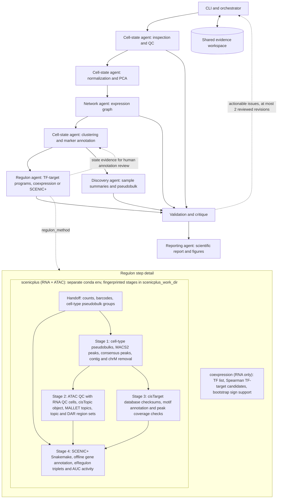

# Reproducible single-cell evidence workflow

A local Python workflow connecting specialist functions through a dependency DAG and shared, versioned artifacts. Scientific calculations remain executable and evidence-bounded. The `ask` command uses a local Ollama model by default to plan a natural-language request and review cluster markers for cell annotation; a marker knowledge base is optional. `run` and `ask --planner rules` can work without an LLM. The repository can be verified with a public PBMC3k count dataset when it is installed locally. One donor and one condition do not support condition-level differential expression.

The package separates orchestration, specialist ownership, and executable tools, following the planner/executor/tool-registry separation in [CellAgent](https://github.com/liu-shiqiang/CellAgent/tree/master). `cli.py` provides terminal commands; `orchestrator.py` owns dependencies, run state, and checkpoints; `agents/` assigns each stage to one specialist; `tools/` contains the scientific functions. `core.py`, `downstream.py`, and `runner.py` retain import compatibility. CellAgent is an architecture reference, not a runtime dependency.

```text
scrna_workflow/
  cli.py             ask, chat, run, resume, plan, tools
  interactive.py     follow-up answers from saved run evidence
  question.py        conservative question parsing and result summary
  llm_planner.py     local LLM question-to-workflow planning
  planner.py         offline stage selection rules
  orchestrator.py    dependency DAG, checkpoints, shared run state
  agents/            cell_state, annotation, network, regulon, discovery, evaluator, reporter
  knowledge/         sourced local marker knowledge bases
  tools/             inspection, QC, preprocessing, graph, clustering, annotation,
                     regulon, pseudobulk discovery, validation, reporting
  core.py            compatibility imports
  downstream.py      compatibility imports
  regulon_scenicplus.py  SCENIC+ regulon orchestration (separate conda env)
  scenicplus_stages/ SCENIC+ stage scripts: peaks, cisTopic, motif databases, eRegulons
  runner.py          compatibility entry point
tests/               CLI, scientific guards, end-to-end resume
```

## Run on a server

Python 3.10+; CPU is sufficient. Install in an isolated environment:

```bash
python -m venv .venv
. .venv/bin/activate
pip install -r requirements-tested.txt
pip install --no-deps .
python -m scrna_workflow plan --config configs/server.yaml
python -m scrna_workflow tools
python -m scrna_workflow run --config configs/server.yaml --input /data/counts.h5ad --markers /data/markers.yaml --output /work/results/run01
python -m scrna_workflow run --config configs/server.yaml --input /data/counts.h5ad --markers /data/markers.yaml --output /work/results/run01 --resume
```

For a plain-language request, use `ask`. Include an existing `.h5ad` or 10x `.h5` path in the question, or pass `--input` for a 10x Matrix Market directory. If `--output` is omitted, a new timestamped directory is created under `results/`. The LLM proposes a structured plan, the scheduler adds dependencies, and `question_summary.md` reports only recorded outputs. An explicit QC-only request runs inspection and QC.

```bash
python -m scrna_workflow ask "Analyze the human PBMC cells in /data/pbmc.h5ad and annotate the clusters"
python -m scrna_workflow ask "Analyze /data/pbmc.h5ad and only do the QC"
python -m scrna_workflow ask "Which cell types and condition changes are present?" \
  --input /data/pbmc.h5ad --knowledge-base /data/markers.yaml \
  --config /data/study.yaml --output /work/results/question01
```

For an interactive session, use `chat`. It accepts any supported `.h5ad`, 10x `.h5`, or 10x Matrix Market directory. The first command runs inspection, QC, preprocessing, graph building, clustering, and annotation once; then a `scRNA>` prompt accepts follow-up questions. Reopen the same artifacts later with `--run-dir`. `exit` ends the conversation. Follow-up answers are stored in `conversation.jsonl` and do not rerun clustering.

```bash
python -m scrna_workflow chat --input /data/cells.h5ad \
  --output /work/results/my_cells
# At the prompt: What markers support cluster 4?
# Later, without running clustering again:
python -m scrna_workflow chat --run-dir /work/results/my_cells
```

Add `--knowledge-base /data/tissue_markers.yaml` when a compatible, sourced reference is available. It makes labels more traceable than the reference-free provisional mode.

The local model receives a compact evidence packet from saved run artifacts, not the expression matrix. It can explain recorded QC, clusters, markers, and annotation uncertainty. Questions requiring an analysis that has not run, such as a condition-level differential-expression test, are not answered from clustering alone. Without a marker knowledge base, any assigned identity is explicitly provisional and needs independent review.

By default, `ask` sends the question text and already configured fields to an installed **local** Ollama model (`qwen2.5:7b`). Start Ollama before using it, or select another installed model with `--llm-model`. The model returns a structured plan containing explicit paths, study fields, and requested analyses. The CLI validates paths against the user's words, maps analyses to a fixed tool list, and adds dependencies. It never executes a model-generated shell command. For offline stage selection and marker overlap annotation, add `--planner rules --annotation-backend markers`. If Ollama is unavailable, the default command fails with a setup message. The expression matrix is never sent to Ollama; cloud model names ending in `:cloud` are rejected.

When annotation is requested, the workflow uses a supplied marker panel if present. Without one, it automatically selects the bundled human immune panel only if positive cluster markers support at least three broad immune lineages and the configured organism is human or unspecified. This panel is derived from the [Seurat PBMC3k marker tutorial](https://satijalab.org/seurat/articles/pbmc3k_tutorial); its automatic selection and inferred labels are recorded in the run. Other datasets use local Ollama to propose **provisional broad identities** from observed positive markers. Code accepts a reference-free label only when at least two cited genes occur in that cluster's positive marker list; otherwise it stays `unknown` or `ambiguous`. An all-unknown response gets one targeted retry. These calls are hypotheses, not validated annotation. Model proposals and decisions are saved in `clustering/llm_annotation_audit.json` when Ollama is used.

`ask` interprets explicit local paths and runs the established scientific steps; it does not infer biological facts from the sentence. Without a suitable marker panel, identities are provisional LLM hypotheses or remain `unknown`. Condition comparisons need sample/donor/condition columns and a reviewed contrast in the YAML; unsupported analyses are reported as skipped. The selected plan is stored in the run manifest. The local LLM route follows [Ollama's structured-output API](https://docs.ollama.com/capabilities/structured-outputs).

Set `primary_comparison: [reference, test]` for unpaired pseudobulk DE (requires at least three independent donors per condition). Paired or longitudinal designs are explicitly skipped pending a reviewed design. Set sample/donor/condition columns, organism, matrix provenance, and locally supplied resource paths in a copied YAML before scientific use. CLI paths are relative to the working directory; YAML paths are relative to the YAML file. Supported count inputs and QC details are documented in `core.py`. Metadata must have cell identifiers in its first column and align exactly to the input cells. Input files remain unchanged; the inspection stage keeps a source snapshot.

Preprocessing removes features whose gene symbols begin with `RPL` or `RPS` (case insensitive) before normalization and PCA. It uses `var['gene_symbols']`, `gene_symbol`, or `gene_name` when present, otherwise feature names; set `gene_symbol_column` in the YAML when another column holds symbols. The QC dataset and source snapshot retain the original genes, while `representation/removed_rpl_rps_genes.tsv` records exclusions. A local marker panel can be supplied with `--markers` or in the workflow YAML. Marker names match gene symbols even when feature IDs are Ensembl IDs. Labels require at least two positive ranked markers and remain `unknown` or `ambiguous` when evidence is insufficient. Open the self-contained `clustering/report.html` to filter clusters, color the embedding by a top marker gene, inspect cells on hover, and review QC, selected PCs, annotations, and marker tables.

```yaml
markers:
  T cells: [CD3D, CD3E, TRAC]
  B cells: [MS4A1, CD79A, CD79B]
```

A portable container specification is provided (container build not tested here):

```bash
docker build -t scrna-workflow .
docker run --rm -v /server/data:/data:ro -v /server/results:/results scrna-workflow --input /data/counts.h5ad --output /results/run01
```

For organism, comparison and donor-aware settings, mount a configuration file and pass `--config /data/config.yaml`. Set thread limits appropriate to your scheduler; `workers` controls concurrent specialist tasks, not BLAS/Numba threads. Memory use depends on cell/feature counts; no GPU is required. Large datasets may need an HPC allocation, particularly regulon correlation and embedding. Do not run two orchestrators in the same output directory.

## SCENIC+ regulons (paired RNA + ATAC)

Set `regulon_method: scenicplus` to replace the RNA-only coexpression candidates with SCENIC+ eRegulons; `configs/pbmc10k_multiome.yaml` is a complete example. SCENIC+ runs as subprocesses in its own conda environment (`envs/scenicplus.yml`, build commands in its header) because it pins pandas 1.5 and scanpy 1.8. Reference resources and MALLET are local files (`public_data/scenicplus_resources/README.md`, `tools/README.md`); nothing is downloaded at run time.

The regulon task (`scrna_workflow/regulon_scenicplus.py`) runs four stages from `scrna_workflow/scenicplus_stages/`:

1. `stage1_peaks`: fragments of each labelled cell type become a pseudobulk; MACS2 peaks are merged into consensus peaks, keeping only `scenicplus_keep_chromosomes` (contigs and chrM removed).
2. `stage2_cistopic`: pycisTopic ATAC QC (cells must also pass RNA QC), cisTopic object, MALLET topic models, and region sets from binarized topics and cell-type DARs.
3. `stage3_motif_databases`: cisTarget database checksums, database/annotation consistency and consensus-peak coverage.
4. `stage4_scenicplus`: the SCENIC+ Snakemake pipeline with offline gene annotation; eRegulon triplets and AUC scores are exported as TSV.

Cell-type labels (`scenicplus_cell_type_column`) must contain at least two types with `scenicplus_min_cells_per_cell_type` cells; `unknown`/`ambiguous` labels are not pseudobulk groups. Completed stages are fingerprinted (parameters, resource size/mtime, upstream results, stage code) in `scenicplus_work_dir` and reused, so a failed run restarted in a new output directory resumes at the failed stage; CPU count and temp directory do not invalidate stages. Expect topic modelling and GRN inference to need a server (tens of GB of RAM, many cores); set `scenicplus_n_cpu`, `scenicplus_mallet_memory_gb` and a short, fast `scenicplus_temp_dir`. Input checksums of files larger than 256 MB are cached in `~/.cache/scrna_workflow/input_digests.json` (override with `SCRNA_WORKFLOW_DIGEST_CACHE`).

## Public PBMC integration test

```bash
export MPLBACKEND=Agg OMP_NUM_THREADS=1 OPENBLAS_NUM_THREADS=1 NUMBA_NUM_THREADS=1
python -m scrna_workflow ask "Analyze the human PBMC cells in results/pbmc3k/pbmc3k_counts_annotated.h5ad and annotate the clusters" \
  --config results/pbmc3k/config.yaml \
  --knowledge-base scrna_workflow/knowledge/human_pbmc_markers.yaml \
  --output /tmp/pbmc-workflow-check
python -m unittest discover -s tests -v
# Optional fresh end-to-end rerun (uses the public PBMC dataset):
SCRNA_RUN_PBMC_INTEGRATION=1 python -m unittest discover -s tests -p test_integration.py -v
```

The optional integration test uses the locally installed public PBMC3k dataset. It is skipped in routine unit test runs to avoid repeatedly running the full pipeline. The local Ollama annotation check requires an installed model; unit tests mock model responses to validate plan and label boundaries. Reference labels in the public PBMC file were inferred from expression and are not independent biological ground truth.

## Architecture and ownership



The dashed edges are review requests, not automatic circular redefinition of states. Runtime execution follows the acyclic dependencies in `orchestrator.DEPS`. Regulon and discovery tasks run concurrently after clustering. Only the orchestrator writes run state; every specialist owns its named subdirectory. Large arrays travel by artifact path, never in agent messages.

Each specialist accepts `ctx = {config, root, artifacts, seed}` and returns JSON-compatible `status`, `input_references`, `outputs`, `metrics`, `warnings`, and `recommended_next_actions`. Outputs are absolute paths. `run_state.json`, `manifest.json`, per-task `result.json`, and `events.jsonl` record input/code/environment hashes, parameters, task calls, results and decisions. Internal numerical operations are documented by function implementations and task metrics; this is task-level tracing, not tracing every library function call.

Resume requires identical input bytes, code, configuration and package versions. Successful artifact hashes are checked before reuse. Modified artifacts invalidate their checkpoints. Scientific failures are preserved, not blindly retried. Only transient I/O exceptions are retried, with a hard limit of two retries. To correct a failed analysis, change the cause and use a new output directory. Validation does not autonomously rewrite results: issues are returned for review; no unbounded revision loop exists. A lock prevents concurrent writers; after a crashed process, verify it is no longer running before deleting its stale `.run.lock`.

## Scientific boundaries

- Count-like integer values are a heuristic, not proof of raw provenance. Explicit `matrix_kind: counts` or a documented count layer is preferred; never reinterpret scaled residuals as counts.
- QC thresholds are within-sample robust outlier rules and require review. Doublet calls and ambient correction have method/input prerequisites; unavailable analyses are reported, not silently assumed complete.
- Batch correction is not automatic. Biological condition and batch may be inseparable, and integration can remove genuine signals.
- Cluster markers are descriptive discovery evidence, not donor-replicated condition DE. Reference-free LLM labels are provisional hypotheses; two matching genes verify only that the model cited observed markers, not that the cell identity is correct.
- Expression graph edges and embedding distances do not imply physical contact. Spatial graphs, ligand–receptor networks, and TF–target networks require distinct resources and definitions.
- TF coexpression without motif support is a candidate module, not a validated regulon or causal interaction. Module activities are relative computational scores.
- SCENIC+ eRegulons add chromatin accessibility and motif enrichment but remain associations inferred from the same cells: not TF binding, perturbation or causal evidence. AUC activities are empty for cells failing ATAC QC. Precomputed SCREEN motif databases only score peaks that overlap SCREEN regions; stage 3 reports that coverage.
- Condition-level inference requires independent biological replication and a specified design; missing donor identifiers cannot be repaired by treating cells as replicates. Paired/longitudinal designs must be preserved.
- External validation, motif enrichment, ligand–receptor inference, pathway testing, and trajectories are not claimed when their prerequisites are absent. Review the generated report for the precise skip reasons and next steps.

## Reproducibility

`requirements-tested.txt` pins the direct scientific dependencies used for testing; `pyproject.toml` defines compatible installation ranges; `environment-tested.txt` captures the actual local environment, which may include unrelated packages and platform-specific dependencies. Each run records exact scientific package versions. The Dockerfile is a deployment recipe, not a verified image or universal platform lock. Seeds are fixed, but UMAP/BLAS outputs may differ across platforms. Input and output SHA-256 hashes provide exact provenance within a run.

Method references: [Scanpy preprocessing and clustering](https://scanpy.scverse.org/en/stable/tutorials/basics/clustering.html), [AnnData format](https://anndata.readthedocs.io/en/stable/), and [Scanpy normalization API](https://scanpy.readthedocs.io/en/stable/generated/scanpy.pp.normalize_total.html).
