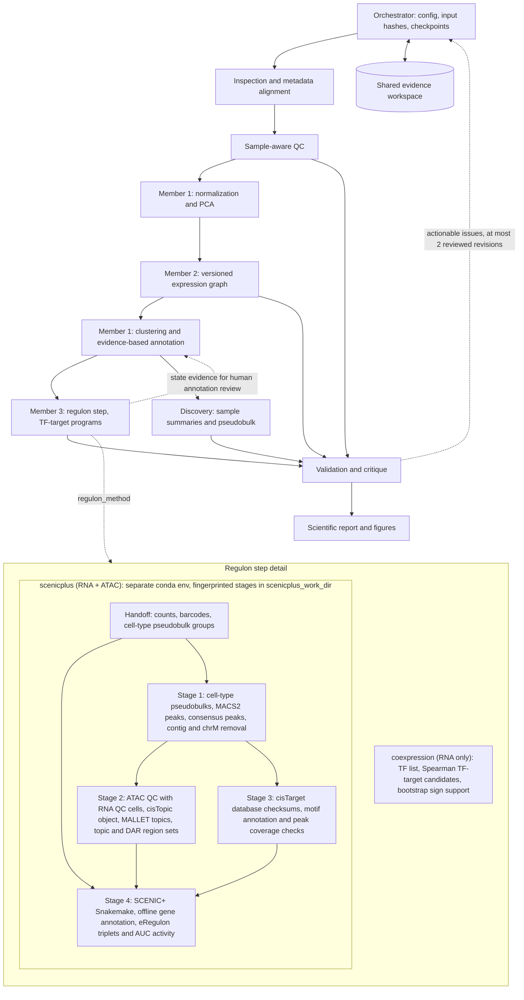

# Reproducible single-cell evidence workflow

A local Python workflow connecting specialist functions through a dependency DAG and shared, versioned artifacts. It runs without an LLM or network connection; scientific calculations are executable, and biological interpretation remains evidence-bounded. The coding agents implementing the workflow are distinct from its deterministic runtime specialists. No biological dataset was supplied with this project. Any bundled execution evidence is **synthetic software-test output**, not biological findings.

## Run on a server

Python 3.10+; CPU is sufficient. Install in an isolated environment:

```bash
python -m venv .venv
. .venv/bin/activate
pip install -r requirements-tested.txt
pip install --no-deps .
python -m scrna_workflow --config configs/server.yaml --input /data/counts.h5ad --output /work/results/run01
python -m scrna_workflow --config configs/server.yaml --input /data/counts.h5ad --output /work/results/run01 --resume
```

Set `primary_comparison: [reference, test]` for unpaired pseudobulk DE (requires at least three independent donors per condition). Paired or longitudinal designs are explicitly skipped pending a reviewed design. Set sample/donor/condition columns, organism, matrix provenance, and locally supplied resource paths in a copied YAML before scientific use. CLI paths are relative to the working directory; YAML paths are relative to the YAML file. Supported count inputs and QC details are documented in `core.py`. Metadata must have cell identifiers in its first column and align exactly to the input cells. Input files remain unchanged; the inspection stage keeps a source snapshot.

A portable container specification is provided (container build not tested here):

```bash
docker build -t scrna-workflow .
docker run --rm -v /server/data:/data:ro -v /server/results:/results scrna-workflow --input /data/counts.h5ad --output /results/run01
```

For organism, comparison and donor-aware settings, mount a configuration file and pass `--config /data/config.yaml`. Set thread limits appropriate to your scheduler; `workers` controls concurrent specialist tasks, not BLAS/Numba threads. Memory use depends on cell/feature counts; no GPU is required. Large datasets may need an HPC allocation, particularly regulon correlation and embedding. Do not run two orchestrators in the same output directory.

## SCENIC+ regulons (paired RNA + ATAC)

Set `regulon_method: scenicplus` to replace the RNA-only coexpression candidates with SCENIC+ eRegulons; `configs/pbmc10k_multiome.yaml` is a complete example. SCENIC+ runs as subprocesses in its own conda environment (`envs/scenicplus.yml`, build commands in its header) because it pins pandas 1.5 and scanpy 1.8. Reference resources and MALLET are local files (`public_data/scenicplus_resources/README.md`, `tools/README.md`); nothing is downloaded at run time.

The regulon task (`scrna_workflow/regulon_scenicplus.py`) runs four stages from `scrna_workflow/scenicplus_stages/`:

1. `stage1_peaks`: fragments of each labelled cell type become a pseudobulk; MACS2 peaks are merged into consensus peaks, keeping only `scenicplus_keep_chromosomes` (contigs and chrM removed).
2. `stage2_cistopic`: pycisTopic ATAC QC (cells must also pass RNA QC), cisTopic object, MALLET topic models, and region sets from binarized topics and cell-type DARs.
3. `stage3_motif_databases`: cisTarget database checksums, database/annotation consistency and consensus-peak coverage.
4. `stage4_scenicplus`: the SCENIC+ Snakemake pipeline with offline gene annotation; eRegulon triplets and AUC scores are exported as TSV.

Cell-type labels (`scenicplus_cell_type_column`) must contain at least two types with `scenicplus_min_cells_per_cell_type` cells; `unknown`/`ambiguous` labels are not pseudobulk groups. Completed stages are fingerprinted (parameters, resource size/mtime, upstream results, stage code) in `scenicplus_work_dir` and reused, so a failed run restarted in a new output directory resumes at the failed stage; CPU count and temp directory do not invalidate stages. Expect topic modelling and GRN inference to need a server (tens of GB of RAM, many cores); set `scenicplus_n_cpu`, `scenicplus_mallet_memory_gb` and a short, fast `scenicplus_temp_dir`. Input checksums of files larger than 256 MB are cached in `~/.cache/scrna_workflow/input_digests.json` (override with `SCRNA_WORKFLOW_DIGEST_CACHE`).

## Synthetic integration test

```bash
export MPLBACKEND=Agg OMP_NUM_THREADS=1 OPENBLAS_NUM_THREADS=1 NUMBA_NUM_THREADS=1
python -m scrna_workflow.synthetic --output /tmp/scrna-smoke
python -m scrna_workflow --config /tmp/scrna-smoke/config.yaml
python -m scrna_workflow --config /tmp/scrna-smoke/config.yaml --resume
python -m unittest discover -s tests -v
```

The generator explicitly marks a 240-cell, 120-feature dataset with six simulated samples. It supplies artificial TF identifiers solely to exercise the candidate-module code. These identifiers are not organism-specific biological resources.

## Architecture and ownership



The dashed edges are review requests, not automatic circular redefinition of states. Runtime execution follows the acyclic dependencies in `runner.DEPS`. Regulon and discovery tasks run concurrently after clustering. Only the orchestrator writes run state; every specialist owns its named subdirectory. Large arrays travel by artifact path, never in agent messages.

Each specialist accepts `ctx = {config, root, artifacts, seed}` and returns JSON-compatible `status`, `input_references`, `outputs`, `metrics`, `warnings`, and `recommended_next_actions`. Outputs are absolute paths. `run_state.json`, `manifest.json`, per-task `result.json`, and `events.jsonl` record input/code/environment hashes, parameters, task calls, results and decisions. Internal numerical operations are documented by function implementations and task metrics; this is task-level tracing, not tracing every library function call.

Resume requires identical input bytes, code, configuration and package versions. Successful artifact hashes are checked before reuse. Modified artifacts invalidate their checkpoints. Scientific failures are preserved, not blindly retried. Only transient I/O exceptions are retried, with a hard limit of two retries. To correct a failed analysis, change the cause and use a new output directory. Validation does not autonomously rewrite results: issues are returned for review; no unbounded revision loop exists. A lock prevents concurrent writers; after a crashed process, verify it is no longer running before deleting its stale `.run.lock`.

## Scientific boundaries

- Count-like integer values are a heuristic, not proof of raw provenance. Explicit `matrix_kind: counts` or a documented count layer is preferred; never reinterpret scaled residuals as counts.
- QC thresholds are within-sample robust outlier rules and require review. Doublet calls and ambient correction have method/input prerequisites; unavailable analyses are reported, not silently assumed complete.
- Batch correction is not automatic. Biological condition and batch may be inseparable, and integration can remove genuine signals.
- Cluster markers are descriptive discovery evidence, not donor-replicated condition DE. Cell identity needs supplied multi-gene marker evidence; absent evidence yields unknown labels.
- Expression graph edges and embedding distances do not imply physical contact. Spatial graphs, ligand–receptor networks, and TF–target networks require distinct resources and definitions.
- TF coexpression without motif support is a candidate module, not a validated regulon or causal interaction. Module activities are relative computational scores.
- SCENIC+ eRegulons add chromatin accessibility and motif enrichment but remain associations inferred from the same cells: not TF binding, perturbation or causal evidence. AUC activities are empty for cells failing ATAC QC. Precomputed SCREEN motif databases only score peaks that overlap SCREEN regions; stage 3 reports that coverage.
- Condition-level inference requires independent biological replication and a specified design; missing donor identifiers cannot be repaired by treating cells as replicates. Paired/longitudinal designs must be preserved.
- External validation, motif enrichment, ligand–receptor inference, pathway testing, and trajectories are not claimed when their prerequisites are absent. Review the generated report for the precise skip reasons and next steps.

## Reproducibility

`requirements-tested.txt` pins the direct scientific dependencies used for testing; `pyproject.toml` defines compatible installation ranges; `environment-tested.txt` captures the actual local environment, which may include unrelated packages and platform-specific dependencies. Each run records exact scientific package versions. The Dockerfile is a deployment recipe, not a verified image or universal platform lock. Seeds are fixed, but UMAP/BLAS outputs may differ across platforms. Input and output SHA-256 hashes provide exact provenance within a run.

Method references: [Scanpy preprocessing and clustering](https://scanpy.scverse.org/en/stable/tutorials/basics/clustering.html), [AnnData format](https://anndata.readthedocs.io/en/stable/), and [Scanpy normalization API](https://scanpy.readthedocs.io/en/stable/generated/scanpy.pp.normalize_total.html).
