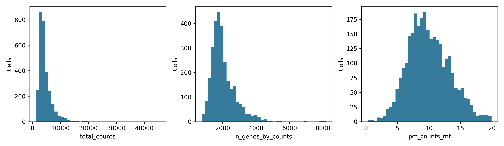
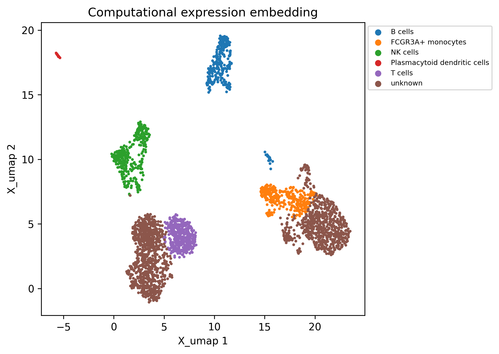
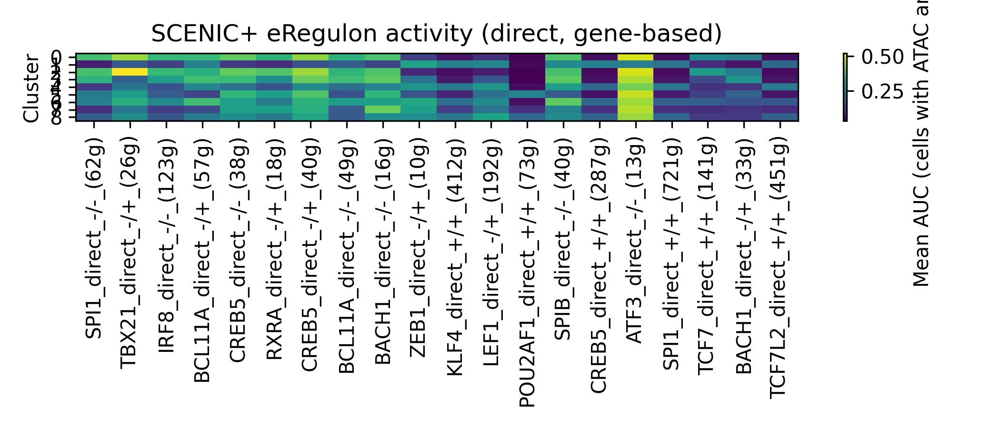
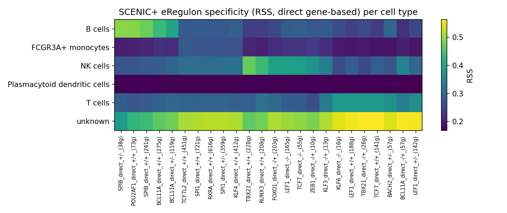
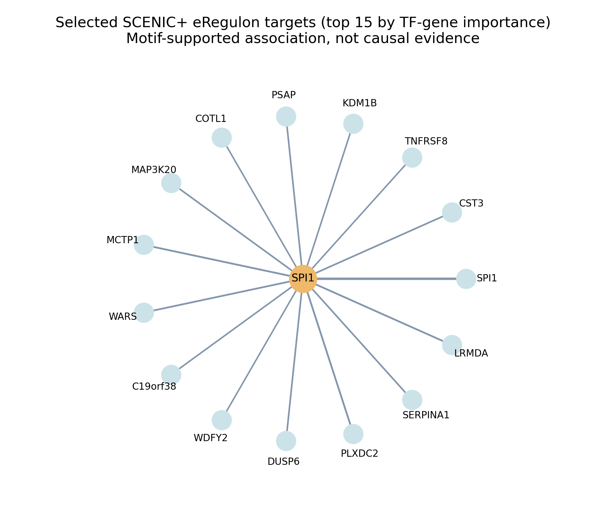
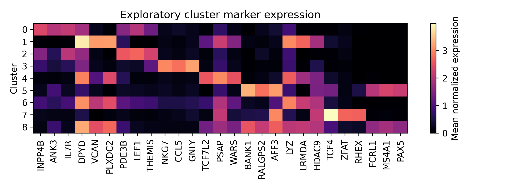

# Single-cell analysis report

This report separates observed outputs, computational inferences, and untested hypotheses.

## Scope

Organism: human. Biological question: unspecified.

Processed dataset contains 2,904 cells and 26,157 features. Source artifact: `/mnt/storageBig8/work/muratli/PBMC10k_subset/results_run4/clustering/annotated.h5ad`.

Embedding distances represent a computational expression projection and do not establish physical proximity.

Regulon specificity scores (RSS) describe how concentrated eRegulon activity is in each cell type; they are descriptive, not a statistical test.

## Principal results and evidence

Full evidence ledger: [evidence_ledger.tsv](evidence_ledger.tsv).

- **Retained dataset: 2904 cells and 26157 features** (observation). Method: AnnData dimensions after QC. Confidence: High for recorded dimensions; depends on QC integrity. Follow-up: Review per-sample cell losses and sample metadata.
- **Expression-based cluster assignments** (computational inference). Method: PCA neighborhood graph and Leiden clustering. Confidence: Exploratory; review stability and marker evidence. Follow-up: Validate cell identities with independent marker panels or a compatible reference.
- **SCENIC+ eRegulons (TF-region-gene triplets)** (computational inference). Method: pycisTopic topics/DARs, cisTarget/DEM motif enrichment, GBM TF-gene and region-gene importance with correlation (SCENIC+). Confidence: Exploratory; motif and accessibility supported association in the same cells, no binding or causal support. Follow-up: Validate key TF-region-target links with perturbation, TF ChIP/CUT&RUN, or held-out donors.

## Inspection

Status: **completed**.

Observed metrics:

```json
{
  "cells": 3000,
  "genes": 36601,
  "duplicate_genes": 0,
  "matrix_kind": "counts",
  "counts_available": true,
  "sparse": true,
  "metadata_columns": [],
  "metadata_missing": {},
  "existing_obsm": [],
  "existing_layers": [
    "counts"
  ],
  "existing_graphs": []
}
```

- Artifact (dataset): `/mnt/storageBig8/work/muratli/PBMC10k_subset/results_run4/inspection/inspected.h5ad`
- Artifact (inventory): `/mnt/storageBig8/work/muratli/PBMC10k_subset/results_run4/inspection/inventory.json`
- Artifact (source_manifest): `/mnt/storageBig8/work/muratli/PBMC10k_subset/results_run4/inspection/source_manifest.json`
- Limitation: Expression scale is inferred; integer nonnegative values do not prove raw-count provenance.

## Qc

Status: **completed**.

Observed metrics:

```json
{
  "input_cells": 3000,
  "retained_cells": 2904,
  "retained_genes": 26257,
  "unique_cell_ids": true,
  "retained_counts_exactly_preserved": true
}
```

- Artifact (thresholds): `/mnt/storageBig8/work/muratli/PBMC10k_subset/results_run4/qc/thresholds.json`
- Artifact (dataset): `/mnt/storageBig8/work/muratli/PBMC10k_subset/results_run4/qc/filtered.h5ad`
- Artifact (cell_qc): `/mnt/storageBig8/work/muratli/PBMC10k_subset/results_run4/qc/cell_qc.csv`
- Limitation: No sample identifier: pooled QC may mask sample effects.
- Limitation: High counts flag potential doublets only. Dedicated doublet/ambient RNA inference requires suitable inputs and configuration.

## Representation

Status: **completed**.

Observed metrics:

```json
{
  "n_pcs": 30,
  "highly_variable_genes": 2000,
  "removed_rpl_rps_genes": 100
}
```

- Artifact (dataset): `/mnt/storageBig8/work/muratli/PBMC10k_subset/results_run4/representation/representation.h5ad`
- Artifact (removed_rpl_rps_genes): `/mnt/storageBig8/work/muratli/PBMC10k_subset/results_run4/representation/removed_rpl_rps_genes.tsv`
- Limitation: Batch integration is not applied automatically; it requires a justified study design.

## Graph

Status: **completed**.

Observed metrics:

```json
{
  "type": "expression_similarity",
  "representation": "X_pca",
  "metric": "euclidean",
  "method": "scanpy.pp.neighbors",
  "n_neighbors": 15,
  "version": "9aa7ebb17f0024a1",
  "components": 2,
  "cells": 2904,
  "edges": 29813
}
```

- Artifact (dataset): `/mnt/storageBig8/work/muratli/PBMC10k_subset/results_run4/graph/graph.h5ad`
- Artifact (graph): `/mnt/storageBig8/work/muratli/PBMC10k_subset/results_run4/graph/expression_graph.npz`
- Artifact (edges): `/mnt/storageBig8/work/muratli/PBMC10k_subset/results_run4/graph/edges.csv`
- Artifact (diagnostics): `/mnt/storageBig8/work/muratli/PBMC10k_subset/results_run4/graph/diagnostics.json`
- Limitation: Expression-similarity edges do not imply physical proximity.

## Clustering

Status: **completed**.

Observed metrics:

```json
{
  "method": "leiden",
  "selected": {
    "resolution": 0.4,
    "n_clusters": 9,
    "silhouette": 0.20900118350982666,
    "seed_ARI": 0.9839258588215907
  },
  "cells": 2904,
  "annotation_backend": "ollama",
  "knowledge_base": {
    "path": "/mnt/storageBig8/work/muratli/Coding_Camps/2026/scrna_workflow/knowledge/human_pbmc_markers.yaml",
    "name": "Human PBMC broad cell types",
    "organism": "human",
    "tissue": "peripheral blood mononuclear cells",
    "source": [
      "https://satijalab.org/seurat/articles/pbmc3k_tutorial",
      "https://pmc.ncbi.nlm.nih.gov/articles/PMC5775029/"
    ]
  },
  "annotation_confidence_type": "heuristic marker overlap, not calibrated probability"
}
```

- Artifact (dataset): `/mnt/storageBig8/work/muratli/PBMC10k_subset/results_run4/clustering/annotated.h5ad`
- Artifact (markers): `/mnt/storageBig8/work/muratli/PBMC10k_subset/results_run4/clustering/markers.csv`
- Artifact (annotations): `/mnt/storageBig8/work/muratli/PBMC10k_subset/results_run4/clustering/annotations.json`
- Artifact (embedding): `/mnt/storageBig8/work/muratli/PBMC10k_subset/results_run4/clustering/embedding.png`
- Artifact (resolution_diagnostics): `/mnt/storageBig8/work/muratli/PBMC10k_subset/results_run4/clustering/resolution_diagnostics.csv`
- Artifact (llm_annotation_audit): `/mnt/storageBig8/work/muratli/PBMC10k_subset/results_run4/clustering/llm_annotation_audit.json`
- Artifact (html_report): `/mnt/storageBig8/work/muratli/PBMC10k_subset/results_run4/clustering/report.html`
- Artifact (qc_figure): `/mnt/storageBig8/work/muratli/PBMC10k_subset/results_run4/clustering/cluster_qc.png`
- Artifact (pc_figure): `/mnt/storageBig8/work/muratli/PBMC10k_subset/results_run4/clustering/selected_pcs.png`
- Limitation: Marker p-values are exploratory cell-level rankings, not condition-level inference.

## Discovery

Status: **skipped**.

- Limitation: Sample-level discovery requires sample_column and clustering labels.
- Follow-up: Supply validated biological sample identifiers; do not substitute individual cells.

## Regulon

Status: **completed**.

Observed metrics:

```json
{
  "method": "scenicplus",
  "eregulons": 45,
  "tfs": 24,
  "target_genes": 3026,
  "regions": 8674,
  "triplets": 13412,
  "cells_with_activity": 1558,
  "extended_eregulons": 25,
  "extended_triplets": 7394,
  "top_rss_per_cell_type": {
    "B cells": {
      "SPIB_direct_+/-_(38g)": 0.4938,
      "POU2AF1_direct_+/+_(73g)": 0.4915,
      "SPIB_direct_+/+_(241g)": 0.4752
    },
    "FCGR3A+ monocytes": {
      "TCF7L2_direct_+/+_(451g)": 0.2805,
      "SPI1_direct_+/+_(721g)": 0.2748,
      "RXRA_direct_+/+_(616g)": 0.2731
    },
    "NK cells": {
      "TBX21_direct_+/+_(228g)": 0.4704,
      "RUNX3_direct_+/+_(208g)": 0.4385,
      "FOXO1_direct_-/+_(203g)": 0.3949
    },
    "Plasmacytoid dendritic cells": {
      "BCL11A_direct_+/+_(275g)": 0.1705,
      "SPIB_direct_+/+_(241g)": 0.1705,
      "ZEB1_direct_-/+_(10g)": 0.1703
    },
    "T cells": {
      "KLF6_direct_-/-_(16g)": 0.3837,
      "LEF1_direct_+/+_(188g)": 0.382,
      "TBX21_direct_-/+_(26g)": 0.3804
    },
    "unknown": {
      "TBX21_direct_-/+_(26g)": 0.5638,
      "TCF7_direct_+/+_(141g)": 0.5635,
      "BCL11A_direct_-/+_(57g)": 0.56
    }
  },
  "cell_type_networks": {
    "B cells": {
      "tfs": 3,
      "regions": 122,
      "target_genes": 45,
      "edges": 324
    },
    "FCGR3A+ monocytes": {
      "tfs": 4,
      "regions": 205,
      "target_genes": 73,
      "edges": 498
    },
    "NK cells": {
      "tfs": 5,
      "regions": 185,
      "target_genes": 87,
      "edges": 499
    },
    "Plasmacytoid dendritic cells": {
      "tfs": 5,
      "regions": 92,
      "target_genes": 63,
      "edges": 270
    },
    "T cells": {
      "tfs": 5,
      "regions": 117,
      "target_genes": 66,
      "edges": 354
    }
  },
  "consensus_peaks": 187083,
  "contig_peaks_removed": 0,
  "atac_rna_cells": 1558,
  "selected_topics": 20,
  "stages_reused": []
}
```

- Artifact (edges): `/mnt/storageBig8/work/muratli/PBMC10k_subset/results_run4/regulon/eregulon_triplets_direct.tsv`
- Artifact (edges_extended): `/mnt/storageBig8/work/muratli/PBMC10k_subset/results_run4/regulon/eregulon_triplets_extended.tsv`
- Artifact (activity): `/mnt/storageBig8/work/muratli/PBMC10k_subset/results_run4/regulon/eregulon_activity_gene_based_direct.tsv.gz`
- Artifact (activity_region_based): `/mnt/storageBig8/work/muratli/PBMC10k_subset/results_run4/regulon/eregulon_activity_region_based_direct.tsv.gz`
- Artifact (activity_extended): `/mnt/storageBig8/work/muratli/PBMC10k_subset/results_run4/regulon/eregulon_activity_gene_based_extended.tsv.gz`
- Artifact (activity_region_based_extended): `/mnt/storageBig8/work/muratli/PBMC10k_subset/results_run4/regulon/eregulon_activity_region_based_extended.tsv.gz`
- Artifact (summary_0): `/mnt/storageBig8/work/muratli/PBMC10k_subset/results_run4/regulon/activity_group_0.tsv`
- Artifact (summary_0_region_based_direct): `/mnt/storageBig8/work/muratli/PBMC10k_subset/results_run4/regulon/activity_group_0_region_based_direct.tsv`
- Artifact (summary_0_gene_based_extended): `/mnt/storageBig8/work/muratli/PBMC10k_subset/results_run4/regulon/activity_group_0_gene_based_extended.tsv`
- Artifact (summary_0_region_based_extended): `/mnt/storageBig8/work/muratli/PBMC10k_subset/results_run4/regulon/activity_group_0_region_based_extended.tsv`
- Artifact (summary_1): `/mnt/storageBig8/work/muratli/PBMC10k_subset/results_run4/regulon/activity_group_1.tsv`
- Artifact (summary_1_region_based_direct): `/mnt/storageBig8/work/muratli/PBMC10k_subset/results_run4/regulon/activity_group_1_region_based_direct.tsv`
- Artifact (summary_1_gene_based_extended): `/mnt/storageBig8/work/muratli/PBMC10k_subset/results_run4/regulon/activity_group_1_gene_based_extended.tsv`
- Artifact (summary_1_region_based_extended): `/mnt/storageBig8/work/muratli/PBMC10k_subset/results_run4/regulon/activity_group_1_region_based_extended.tsv`
- Artifact (rss_0): `/mnt/storageBig8/work/muratli/PBMC10k_subset/results_run4/regulon/rss_group_0.tsv`
- Artifact (rss_rank_plot): `/mnt/storageBig8/work/muratli/PBMC10k_subset/results_run4/regulon/rss_ranks.png`
- Artifact (rss_heatmap): `/mnt/storageBig8/work/muratli/PBMC10k_subset/results_run4/regulon/rss_heatmap.png`
- Artifact (rss_0_region_based_direct): `/mnt/storageBig8/work/muratli/PBMC10k_subset/results_run4/regulon/rss_group_0_region_based_direct.tsv`
- Artifact (rss_rank_plot_region_based_direct): `/mnt/storageBig8/work/muratli/PBMC10k_subset/results_run4/regulon/rss_ranks_region_based_direct.png`
- Artifact (rss_heatmap_region_based_direct): `/mnt/storageBig8/work/muratli/PBMC10k_subset/results_run4/regulon/rss_heatmap_region_based_direct.png`
- Artifact (rss_0_gene_based_extended): `/mnt/storageBig8/work/muratli/PBMC10k_subset/results_run4/regulon/rss_group_0_gene_based_extended.tsv`
- Artifact (rss_rank_plot_gene_based_extended): `/mnt/storageBig8/work/muratli/PBMC10k_subset/results_run4/regulon/rss_ranks_gene_based_extended.png`
- Artifact (rss_heatmap_gene_based_extended): `/mnt/storageBig8/work/muratli/PBMC10k_subset/results_run4/regulon/rss_heatmap_gene_based_extended.png`
- Artifact (rss_0_region_based_extended): `/mnt/storageBig8/work/muratli/PBMC10k_subset/results_run4/regulon/rss_group_0_region_based_extended.tsv`
- Artifact (rss_rank_plot_region_based_extended): `/mnt/storageBig8/work/muratli/PBMC10k_subset/results_run4/regulon/rss_ranks_region_based_extended.png`
- Artifact (rss_heatmap_region_based_extended): `/mnt/storageBig8/work/muratli/PBMC10k_subset/results_run4/regulon/rss_heatmap_region_based_extended.png`
- Artifact (rss_1): `/mnt/storageBig8/work/muratli/PBMC10k_subset/results_run4/regulon/rss_group_1.tsv`
- Artifact (rss_1_region_based_direct): `/mnt/storageBig8/work/muratli/PBMC10k_subset/results_run4/regulon/rss_group_1_region_based_direct.tsv`
- Artifact (rss_1_gene_based_extended): `/mnt/storageBig8/work/muratli/PBMC10k_subset/results_run4/regulon/rss_group_1_gene_based_extended.tsv`
- Artifact (rss_1_region_based_extended): `/mnt/storageBig8/work/muratli/PBMC10k_subset/results_run4/regulon/rss_group_1_region_based_extended.tsv`
- Artifact (network_nodes_B_cells): `/mnt/storageBig8/work/muratli/PBMC10k_subset/results_run4/regulon/networks/B_cells_nodes.tsv`
- Artifact (network_edges_B_cells): `/mnt/storageBig8/work/muratli/PBMC10k_subset/results_run4/regulon/networks/B_cells_edges.tsv`
- Artifact (network_graphml_B_cells): `/mnt/storageBig8/work/muratli/PBMC10k_subset/results_run4/regulon/networks/B_cells.graphml`
- Artifact (network_plot_B_cells): `/mnt/storageBig8/work/muratli/PBMC10k_subset/results_run4/regulon/networks/B_cells.png`
- Artifact (network_nodes_FCGR3A_monocytes): `/mnt/storageBig8/work/muratli/PBMC10k_subset/results_run4/regulon/networks/FCGR3A_monocytes_nodes.tsv`
- Artifact (network_edges_FCGR3A_monocytes): `/mnt/storageBig8/work/muratli/PBMC10k_subset/results_run4/regulon/networks/FCGR3A_monocytes_edges.tsv`
- Artifact (network_graphml_FCGR3A_monocytes): `/mnt/storageBig8/work/muratli/PBMC10k_subset/results_run4/regulon/networks/FCGR3A_monocytes.graphml`
- Artifact (network_plot_FCGR3A_monocytes): `/mnt/storageBig8/work/muratli/PBMC10k_subset/results_run4/regulon/networks/FCGR3A_monocytes.png`
- Artifact (network_nodes_NK_cells): `/mnt/storageBig8/work/muratli/PBMC10k_subset/results_run4/regulon/networks/NK_cells_nodes.tsv`
- Artifact (network_edges_NK_cells): `/mnt/storageBig8/work/muratli/PBMC10k_subset/results_run4/regulon/networks/NK_cells_edges.tsv`
- Artifact (network_graphml_NK_cells): `/mnt/storageBig8/work/muratli/PBMC10k_subset/results_run4/regulon/networks/NK_cells.graphml`
- Artifact (network_plot_NK_cells): `/mnt/storageBig8/work/muratli/PBMC10k_subset/results_run4/regulon/networks/NK_cells.png`
- Artifact (network_nodes_Plasmacytoid_dendritic_cells): `/mnt/storageBig8/work/muratli/PBMC10k_subset/results_run4/regulon/networks/Plasmacytoid_dendritic_cells_nodes.tsv`
- Artifact (network_edges_Plasmacytoid_dendritic_cells): `/mnt/storageBig8/work/muratli/PBMC10k_subset/results_run4/regulon/networks/Plasmacytoid_dendritic_cells_edges.tsv`
- Artifact (network_graphml_Plasmacytoid_dendritic_cells): `/mnt/storageBig8/work/muratli/PBMC10k_subset/results_run4/regulon/networks/Plasmacytoid_dendritic_cells.graphml`
- Artifact (network_plot_Plasmacytoid_dendritic_cells): `/mnt/storageBig8/work/muratli/PBMC10k_subset/results_run4/regulon/networks/Plasmacytoid_dendritic_cells.png`
- Artifact (network_nodes_T_cells): `/mnt/storageBig8/work/muratli/PBMC10k_subset/results_run4/regulon/networks/T_cells_nodes.tsv`
- Artifact (network_edges_T_cells): `/mnt/storageBig8/work/muratli/PBMC10k_subset/results_run4/regulon/networks/T_cells_edges.tsv`
- Artifact (network_graphml_T_cells): `/mnt/storageBig8/work/muratli/PBMC10k_subset/results_run4/regulon/networks/T_cells.graphml`
- Artifact (network_plot_T_cells): `/mnt/storageBig8/work/muratli/PBMC10k_subset/results_run4/regulon/networks/T_cells.png`
- Artifact (network_summary): `/mnt/storageBig8/work/muratli/PBMC10k_subset/results_run4/regulon/networks/summary.tsv`
- Artifact (diagnostics): `/mnt/storageBig8/work/muratli/PBMC10k_subset/results_run4/regulon/diagnostics.json`
- Limitation: eRegulons are inferred TF-region-gene associations (TF and target co-variation, region accessibility-gene correlation and motif enrichment in the same cells); they are not binding, perturbation or causal evidence.
- Limitation: AUC activity is computed on the same cells used for inference and is not independent evidence of a cell state.
- Limitation: RSS ranks eRegulons by how concentrated their activity is in a group relative to all scored cells; it is descriptive, depends on the group definitions, and is not a statistical test.
- Limitation: No DARs passed thresholds for: ['Plasmacytoid_dendritic_cells']
- Limitation: 1346 of 2904 RNA-QC cells have no eRegulon activity (failed ATAC QC); their activity is empty.

## Validation

Status: **completed**.

Observed metrics:

```json
{
  "checks": {
    "cell_identifiers_unique": true,
    "gene_identifiers_unique": true,
    "metadata_aligned": true,
    "graph_dimensions_connectivities": true,
    "graph_dimensions_distances": true,
    "count_shape": true,
    "counts_nonnegative_integer": true,
    "qc_cell_order_preserved": true,
    "qc_gene_subset_order_preserved": true,
    "gene_filter_accounted_for": true,
    "excluded_genes_match_rpl_rps_rule": true,
    "counts_preserved_since_qc": true,
    "retained_identifiers_in_inspected_input": true,
    "retained_counts_preserved_since_inspection": true
  },
  "failed_checks": 0
}
```

- Artifact (validation): `/mnt/storageBig8/work/muratli/PBMC10k_subset/results_run4/validation/validation.json`
- Limitation: These checks establish internal integrity, not independent biological validation.
- Limitation: No external dataset or held-out donor validation was performed.
- Limitation: Regulons defining a state cannot independently validate that state.
- Follow-up: Review unresolved issues and use targeted donor-held-out or external validation where available.

## Evidence interpretation

Dataset counts and QC summaries are observations. Clusters, annotations and regulatory modules (coexpression candidates or SCENIC+ eRegulons) are computational inferences. Regulatory mechanisms remain hypotheses requiring independent perturbation or binding evidence. Sample-level descriptive tables do not establish statistically significant condition effects.

Confidence is limited by the checks and unresolved warnings recorded above; successful execution is not biological validation.

## Figures












